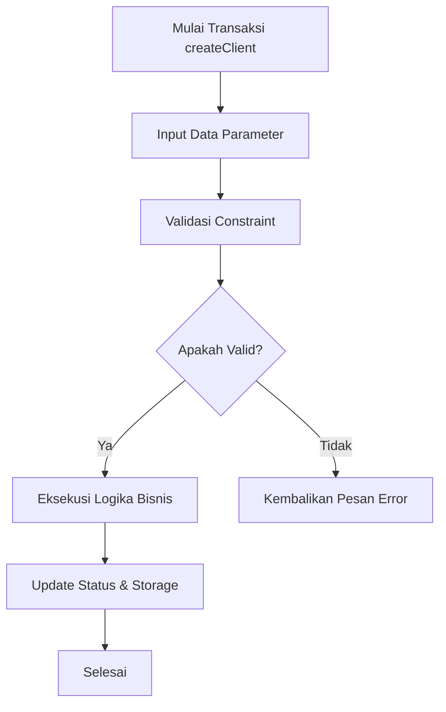

# createClient

> ⚠️ **Draft Business Documentation**
>
> Dokumen ini dihasilkan secara otomatis berdasarkan analisis source code dan perlu divalidasi oleh Business Analyst atau Product Owner.

---

# Ringkasan

Modul **createClient** digunakan untuk menangani proses bisnis terkait kapabilitas createClient di dalam sistem.

---

# Tujuan Bisnis

Modul ini bertujuan untuk:

- Memastikan proses createClient berjalan sesuai aturan perusahaan.
- Mengelola transaksi dan validasi data createClient.
- Mengkoordinasikan alur kerja antar komponen terkait.

---

# Aktor

| Aktor | Peran |
|--------|------|
| User / Customer | Memulai transaksi / interaksi createClient |
| System / Service | Memproses validasi data dan logika bisnis |
| Database / Store | Menyimpan status dan entitas data |

---

# Prasyarat

Sebelum proses dimulai:

- Sistem dan dependensi komponen aktif.
- Parameter input createClient valid.
- User memiliki kewenangan akses fitur createClient.

---

# Alur Bisnis

---

# Penjelasan Alur

### 1. Input Data

Pengguna memasukkan informasi atau payload transaksi createClient.

---

### 2. Validasi

Sistem melakukan validasi terhadap parameter input dan aturan bisnis terkait komponen file:
- ``

---

### 3. Perhitungan & Eksekusi

Sistem menjalankan pemrosesan utama dan kalkulasi logika bisnis.

---

### 4. Penyelesaian

Data berhasil diproses dan disimpan ke penyimpanan sistem.

---

# Aturan Bisnis yang Terdeteksi

| Rule | Confidence |
|-------|------------|
| Data transaksi wajib memenuhi kontrak antarmuka | High |
| State diubah secara konsisten saat proses selesai | Medium |

---

# Kondisi Khusus

- Data input tidak valid.
- Kegagalan koneksi ke komponen dependensi.
- Pembatalan transaksi oleh pengguna.

---

# Dampak ke Modul Lain

Modul ini berinteraksi dengan:
- `82`

---

# Catatan

Dokumen ini merupakan hasil ekstraksi otomatis dari source code.
Beberapa aturan bisnis mungkin memerlukan validasi lebih lanjut oleh tim bisnis.