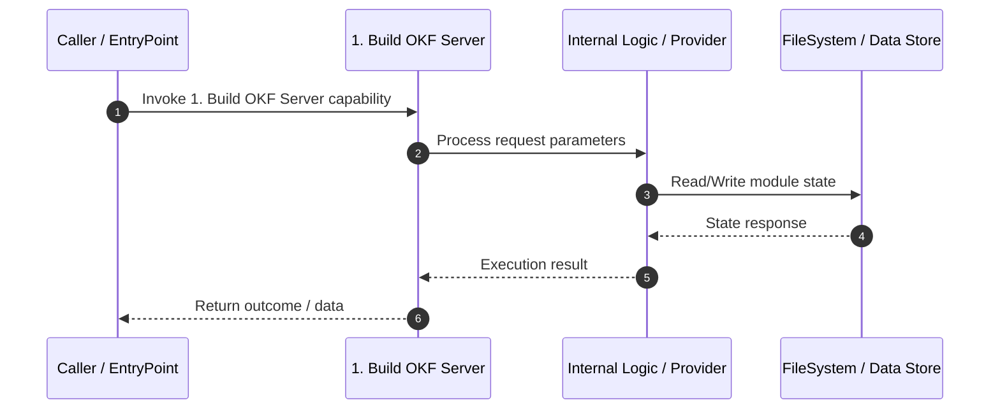

# Technical Specification: 1. Build OKF Server

## 1. Overview
Technical specification and architectural contract for **1. Build OKF Server**.

---

## 2. Technical Sequence Diagram

---

## 3. Related Components

### Knowledge Graph Nodes (1)
- `48`

### Source Files (1)
- ``

---

## 4. Architecture & Execution Details
*Implementation details extracted from Knowledge Graph analysis.*

- **Module Scope**: 1. Build OKF Server
- **Data Mutability**: State updates written via OKF Storage adapter.
- **Dependencies**: Interacts with related graph components.