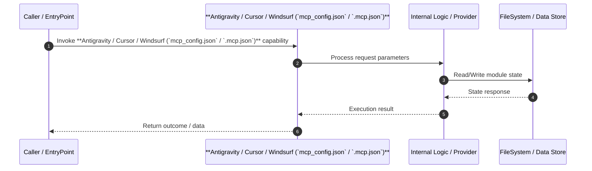

# Technical Specification: **Antigravity / Cursor / Windsurf (`mcp_config.json` / `.mcp.json`)**

## 1. Overview
Technical specification and architectural contract for ****Antigravity / Cursor / Windsurf (`mcp_config.json` / `.mcp.json`)****.

---

## 2. Technical Sequence Diagram

---

## 3. Related Components

### Knowledge Graph Nodes (1)
- `51`

### Source Files (1)
- ``

---

## 4. Architecture & Execution Details
*Implementation details extracted from Knowledge Graph analysis.*

- **Module Scope**: **Antigravity / Cursor / Windsurf (`mcp_config.json` / `.mcp.json`)**
- **Data Mutability**: State updates written via OKF Storage adapter.
- **Dependencies**: Interacts with related graph components.