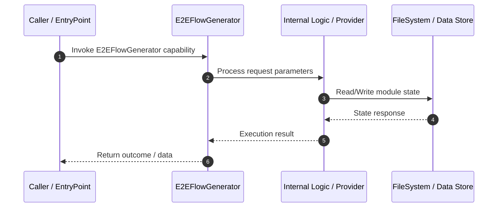

# Technical Specification: E2EFlowGenerator

## 1. Overview
Technical specification and architectural contract for **E2EFlowGenerator**.

---

## 2. Technical Sequence Diagram

---

## 3. Related Components

### Knowledge Graph Nodes (1)
- `src/planner/e2eFlowGenerator.ts#class#E2EFlowGenerator`

### Source Files (1)
- `src/planner/e2eFlowGenerator.ts`

---

## 4. Architecture & Execution Details
*Implementation details extracted from Knowledge Graph analysis.*

- **Module Scope**: E2EFlowGenerator
- **Data Mutability**: State updates written via OKF Storage adapter.
- **Dependencies**: Interacts with related graph components.