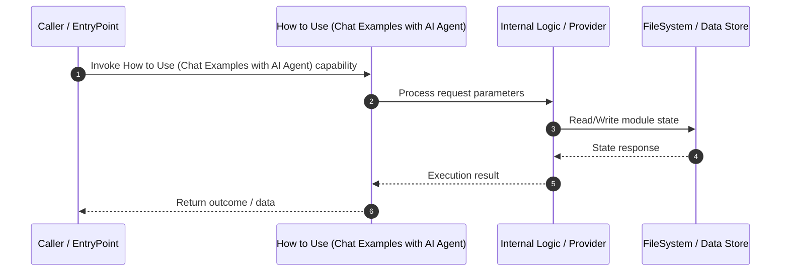

# Technical Specification: How to Use (Chat Examples with AI Agent)

## 1. Overview
Technical specification and architectural contract for **How to Use (Chat Examples with AI Agent)**.

---

## 2. Technical Sequence Diagram

---

## 3. Related Components

### Knowledge Graph Nodes (1)
- `52`

### Source Files (1)
- ``

---

## 4. Architecture & Execution Details
*Implementation details extracted from Knowledge Graph analysis.*

- **Module Scope**: How to Use (Chat Examples with AI Agent)
- **Data Mutability**: State updates written via OKF Storage adapter.
- **Dependencies**: Interacts with related graph components.