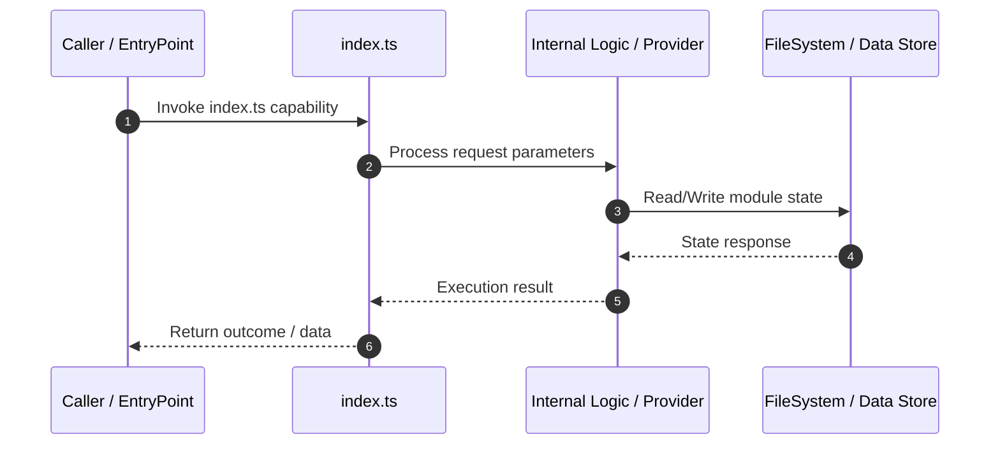

# Technical Specification: index.ts

## 1. Overview
Technical specification and architectural contract for **index.ts**.

---

## 2. Technical Sequence Diagram

---

## 3. Related Components

### Knowledge Graph Nodes (10)
- `src/analyzer/index.ts`
- `src/executor/index.ts`
- `src/exporter/index.ts`
- `src/generator/index.ts`
- `src/index.ts`
- `src/mcp/index.ts`
- `src/planner/index.ts`
- `src/storage/index.ts`
- `src/types/index.ts`
- `src/workflow/index.ts`

### Source Files (10)
- `src/analyzer/index.ts`
- `src/executor/index.ts`
- `src/exporter/index.ts`
- `src/generator/index.ts`
- `src/index.ts`
- `src/mcp/index.ts`
- `src/planner/index.ts`
- `src/storage/index.ts`
- `src/types/index.ts`
- `src/workflow/index.ts`

---

## 4. Architecture & Execution Details
*Implementation details extracted from Knowledge Graph analysis.*

- **Module Scope**: index.ts
- **Data Mutability**: State updates written via OKF Storage adapter.
- **Dependencies**: Interacts with related graph components.