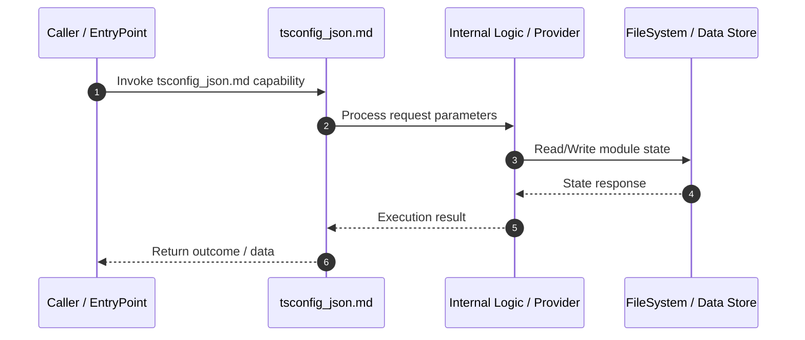

# Technical Specification: tsconfig_json.md

## 1. Overview
Technical specification and architectural contract for **tsconfig_json.md**.

---

## 2. Technical Sequence Diagram

---

## 3. Related Components

### Knowledge Graph Nodes (2)
- `.vidya/business/tsconfig_json.md`
- `.vidya/technical/tsconfig_json.md`

### Source Files (2)
- `.vidya/business/tsconfig_json.md`
- `.vidya/technical/tsconfig_json.md`

---

## 4. Architecture & Execution Details
*Implementation details extracted from Knowledge Graph analysis.*

- **Module Scope**: tsconfig_json.md
- **Data Mutability**: State updates written via OKF Storage adapter.
- **Dependencies**: Interacts with related graph components.