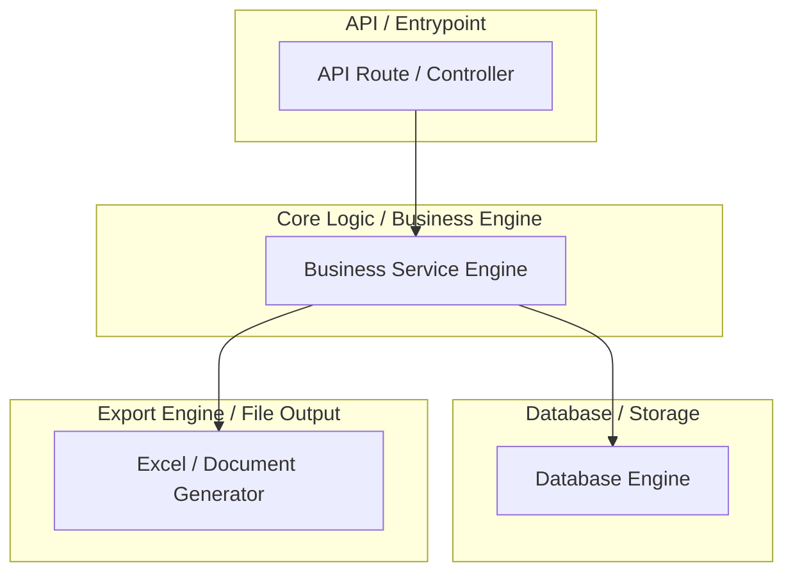
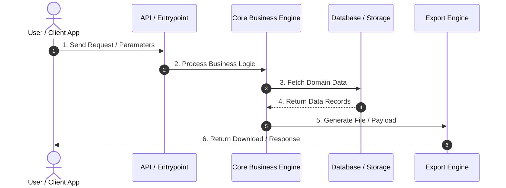

# Design Spec: Level 0 Macro Business & Architecture Overview

**Date**: 2026-08-08  
**Status**: Approved  
**Scope**: High-level, natural human-readable E2E flow generation for Nexus  

---

## 1. Goal

Provide an immediate, easy-to-understand onboarding document (`.nexus/e2e_flow.md`) for new team members, product managers, and developers joining a project. The document must communicate **what the system does and its macro business flow** without flooding the reader with 8,000 lines of low-level function code or raw AST dumps.

---

## 2. Core Principles

1. **Macro Architecture Focus (Level 0)**: Show only top-level domains/sub-systems (e.g., API Entrypoints, Core Business Engine, Database/Storage, Export Engine).
2. **Natural Industry Terminology**: Avoid robotic AI translations. Use standard dev/PM terms:
   - `API / Entrypoint`
   - `Core Logic / Business Engine`
   - `Database / Storage`
   - `Export Engine / File Output`
3. **Diagram-First Presentation**: Prioritize two clean Mermaid diagrams:
   - **Macro Business Flowchart** (`flowchart TD`)
   - **End-to-End Sequence Diagram** (`sequenceDiagram`)
4. **No Low-Level Function Dumping**: Do NOT list individual 1-line helper functions or raw 5,000-line function call edge tables.

---

## 3. Document Structure (`.nexus/e2e_flow.md`)

```markdown
# [Project Name] - System & Business Flow Overview

> 💡 **Level 0 Onboarding & Architecture Summary**
> Dokumen ini menyajikan alur arsitektur dan bisnis utama sistem dari API Entrypoint hingga Output.

---

## 1. Gambaran Umum Sistem
Ringkasan singkat fungsi utama aplikasi dan domain bisnis utama.

---

## 2. Diagram Alur Utama Sistem (Macro Flowchart)


---

## 3. Diagram Urutan Proses (End-to-End Sequence Diagram)


---

## 4. Modul Bisnis Utama
Tabel ringkas modul, fungsi utama, dan berkas entri kunci.

| Modul | Fungsi Utama | Entrypoint / Core File |
|-------|--------------|------------------------|
| **Core** | Business Logic & Workflow | `src/index.ts` |
| **Export** | Document & Excel Generation | `src/exporter/index.ts` |

---

## 5. Matriks Dependensi Modul
Tabel dependensi tingkat tinggi antar-modul (tanpa baris function internal).
```

---

## 4. Implementation Strategy

1. **Refactor `src/planner/e2eFlowGenerator.ts`**:
   - Apply natural dev/PM terminology mapping.
   - Aggregate nodes by file / module entrypoints.
   - Limit subgraph nodes to top-level entrypoints.
2. **Refactor `src/executor/index.ts`**:
   - Ensure module execution worker produces matching clean sequence diagrams.
